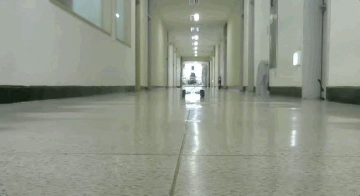
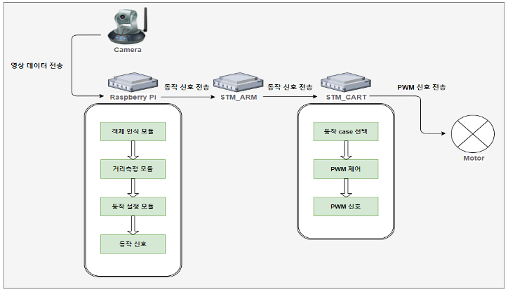
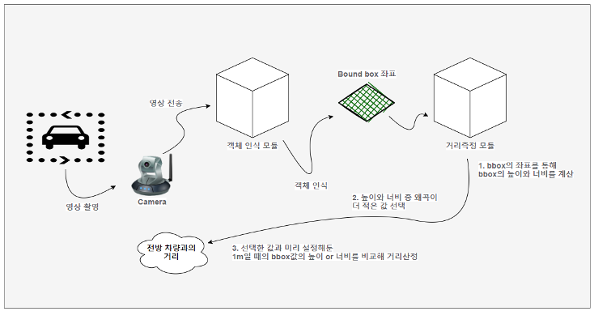
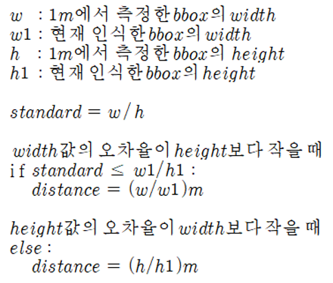

# 자율 주행차의 영상 기반 차간거리 유지 개발

## Table of Contents
  - [프로젝트 소개](#프로젝트-소개)
  - [주요 기능](#주요-기능)
  - [시스템 구조](#시스템-구조)
  - [디렉토리 구조](#디렉토리-구조)
  - [결과](#결과)
  - [실행 방법](#실행-방법)
  - [참조](#참조)
  - [팀원](#팀원)

<br>

## 프로젝트 소개

<p align="center">
  
</p>

<br>

**딥러닝을 기반으로 단안 카메라의 영상을 활용해 차간 거리를 일정하게 유지하며 주행하는**  
**Adaptive Cruise Control 기능을 제공한다.**

<br>

## 주요 기능

* 본 프로젝트는 차량 키트에 부착된 단안 카메라로 촬영된 실시간 영상정보를 기반으로 전방에 있는 타 차량 키트와의 거리를 추정하고, 획득한 거리정보를 이용하여 차량의 속도를 제어해 전방에 있는 차량과 일정 거리 이상 가까워지지 않도록 거리유지를 하며 주행하는 기술을 구현하고자 한다.
이를 달성하기 위한 첫 번째 목표로 주행환경에서 촬영한 차량 키트 이미지를 라벨링을 통해 데이터셋을 제작한다.
두 번째 목표로 위에서 획득한 데이터셋을 초당 프레임 수가 높은 딥러닝 모델에 학습시켜 실시간으로 전방에 있는 차량을 인식할 수 있도록 한다.
세 번째 목표로 전방에 있는 차량으로부터 얻어진 인식 결과를 통해 거리를 예측하는 알고리즘을 구현한다.
마지막으로 예측된 거리데이터를 기반으로 차량의 속도를 제어하여 일정 거리를 유지하며 주행할 수 있도록 하며 이 때, 주행환경이 오르막길이나 커브 길일지라도 거리를 유지할 수 있도록 구현한다.

<br>

## 시스템 구조

### 거리유지 시스템 구조

<p align="center">
  
</p>

### 겍체 인식 및 거리측정 시스템 구조

<p align="center">
  
</p>

### 거리측정 알고리즘

<p align="center">
  
</p>

- 카메라의 해상도에 따라 1m에서 기준이 되는 bound box의 width와 height의 크기가 달라진다

<br>

## 디렉토리 구조
```shell
adaptive-cruise-control
├── cart
│   ├── main_arm.c
│   ├── main_cart.c
│   └── README.md
│
├── dataset
│   └── ...
│
├── yolov5
│   ├── detect_custom.py
│   ├── cart_model.pt
│   └── ...
│
└── README.md
```

<br>

## 결과

### 실시간 객체 인식 및 거리측정

<p align="center">
  
</p>

* 학습된 가중치 모델을 바탕으로 단안 카메라를 이용하여 전방 차량 키트를 인식하였다.

* 인식된 차량 키트에 대한 Bounding Box에서 왼쪽부터 클래스명, 예측 정확도, 단안 카메라 기준 예측 거리(cm) 를 나타낸다.

* 인식 결과, 이미지 크기 128*128 기준 평균적으로 `초당 약 3 프레임의 속도`로 동작하였으며, `최대 5m`까지 높은 정확도로 인식됨을 확인할 수 있었다.

* **거리 예측 오차율 측정 결과**

| 실제 거리 | 측정 최소 거리 | 측정 최대 거리 | 최대 오차율 |
| :---: | :---: | :---: | :---: |
| 0.5m | 0.47m | 0.53m | 6% |
| 1m | 0.96m | 1.02m | 3% |
| 2m | 1.98m | 2.02m | 1% |
| 3m | 2.85m | 2.94m | 5% |
| 5m | 4.65m | 5.05m | 7% |

### 거리유지

1. 전방 차량과의 거리가 70cm보다 가까워진 경우 **차량 정지**
2. 전방 차량과의 거리가 70cm ~ 120cm인 경우 **큰 폭으로 속도 감소**
3. 전방 차량과의 거리가 120cm ~ 150cm 인 경우 **작은 폭으로 속도 감소**
4. 전방 차량이 없거나 거리가 150cm 보다 먼 경우 **원래 주행 속도로 복구**

<br>

## 실행 방법

### YOLO v5를 활용한 실시간 객체 인식 및 거리 예측

1. https://github.com/sungjuGit/Pytorch-and-Vision-for-Raspberry-Pi-4B 에서 Pytorch, Pytorch Vision 설치에 필요한 wheel 파일을 라즈베리파이에 다운로드한다.

2. `sudo pip3 install torch-1.8.0a0+56b43f4-cp37-cp37m-linux_armv7l.whl`  
   `sudo pip3 install torchvision-0.9.0a0+8fb5838-cp37-cp37m-linux_armv7l.whl`

3. `adative-cruise-control/yolov5`를 라즈베리파이에 클론한다.

4. `pip install -r requirements.txt`으로 필요한 종속 라이브러리를 설치한다.

5. `python3 detect_custom.py --weights cart_model.pt --img 128 --conf 0.4 --source 0` 으로 실시간 객체 인식 및 거리 예측을 한다.

> detect_custom.py : 객체인식 및 거리 예측을 위한 파이썬 파일  
> cart_model.pt : 커스텀 이미지로 학습된 yolo-v5s 가중치 모델  

<br>

### 거리 예측을 바탕으로 카트 구동

1. `https://github.com/seoh02h/ICNS-Self-Driving-Test`을 노트북에 클론한다.

2. `ICNS-Self-Driving-Test/robot_arm_basic/Src/main.c`을 `adaptive-cruise-control/cart/main_arm.c`으로 대치시킨다.

3. `ICNS-Self-Driving-Test/cart_basic/Src/main.c`을 `adaptive-cruise-control/cart/main_cart.c`으로 대치시킨다.

4. [ICNS Lab](https://github.com/icns-distributed-cloud)에서 제작한 카트에 있는 `STM-Arm Board`, `STM-Cart Board`에 각 코드를 디버깅한다.

<br>

## 참조

* Ultralytics, YOLO v5(2020), Retrieved June, 10, 2020, from https://github.com/ultralytics/yolov5

* https://global.honda/newsroom/news/2020/4201111eng.html

* 이동석 외 4 저, 스테레오 카메라를 이용한 이동객체의 실시간 추적과 거리 측정시스템(2009)

* 이강원 외 1 저, 지형 공간정보체계 용어사전(2016)

* https://github.com/seoh02h/ICNS-Self-Driving-Test

* https://ropiens.tistory.com/44

* https://github.com/sungjuGit/Pytorch-and-Vision-for-Raspberry-Pi-4B

<br>

## 팀원

* 권동영 (2016110307) [@Chuncheonian](https://github.com/Chuncheonian) , [E-mail](ehddud2468@khu.ac.kr)
* 신동해 (2018110651) [@Jeensh](https://github.com/Jeensh)

<br>

[👆Back To The Top](#자율-주행차의-영상-기반-차간거리-유지-개발)